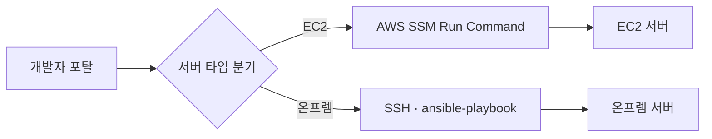

## 배경

사내에는 배포, 서버 접근, 보안 점검처럼 반복되지만 사람이 수작업으로 처리하던 운영 업무가 여러 군데 흩어져 있었음

- **무리뷰 배포** — 레포에 쓰기 권한만 있으면 리뷰 없이도 누구나 main에 배포 가능, 배포 성공·실패 여부도 Bitbucket을 직접 열어야 확인 가능
- **파편화된 보안 현황** — AWS 쪽 보안 리소스(ACM 인증서 만료, S3 버킷 설정, OSV 기반 의존성 취약점)를 필요할 때마다 콘솔이나 스크립트로 따로 확인

이 두 가지 문제를 하나의 게이트로 묶어보자는 생각에서 개발자 포탈 구축 시작

기능은 아래 순서로 확장

1. 배포 승인 게이트 + 보안 모니터링, 이 두 축으로 시작
2. 서버 계정 생성·SSH 키 등록도 결국 사람이 슬랙으로 요청하고 관리자가 수동으로 처리하는 패턴이 반복되는 걸 보고 접근제어 기능 추가
3. 온프렘·EC2 서버 인벤토리, 웹터미널, SSH 프록시, 서비스 카탈로그, 장애 관리(Incident) 순차 추가

지금은 배포 승인 게이트를 넘어 사내 운영 전반을 다루는 개발자 포탈 형태로 확장

## 접근

구조를 잡을 때 가장 먼저 정한 원칙은 DB를 두지 않는 것
사내 도구라 트래픽이 크지 않고 백업·마이그레이션·커넥션 관리 같은 운영 부담을 늘리고 싶지 않아서, 모든 상태를 JSON 파일과 스레드 세이프 클래스(`threading.RLock`)로 관리하는 Store 패턴을 처음부터 채택
지금도 새 기능을 붙일 때마다 이 패턴을 그대로 유지

실행 대상이 EC2와 온프렘 서버로 나뉘는 것도 초반에 정리해야 했던 부분
Ansible의 EC2 관련 플러그인에 버그가 있어서 완전히 분기하는 쪽으로 방향 결정

이후에 붙는 접근제어·보안점검 기능도 전부 이 분기를 재사용하는 구조로 구성

인증은 처음엔 Keycloak을 붙이지 못한 상태

1. `verify_token`이 그냥 통과되는 개발 편의용 바이패스를 열어둠, 이걸 어디까지나 임시로만 여기고 신규 API에도 계속 `Depends(verify_token)`을 붙이는 규칙 유지
2. 2026-07-29 Keycloak 연동 시 이 규칙 덕분에 별도 리팩토링 없이 바로 인증 적용

### AI 페어코딩을 다룬 방식

구현은 Claude Code로 진행했지만, 아키텍처 판단은 직접 내리고 AI에는 그 판단을 구현하도록 맡기는 방식으로 작업
패턴을 먼저 고정하는 게 핵심

- **Store** — "JSON 파일 + 스레드 세이프 클래스 + 모듈 싱글턴" 구조
- **API 라우터** — 인증 그룹 분리 방식

이렇게 먼저 정하고 `CLAUDE.md`에 문서화해서 새 기능을 만들 때마다 AI가 같은 패턴을 반복하도록 강제
패턴 문서화 없이 매번 새로 프롬프트를 짜면 코드베이스가 기능마다 스타일이 달라지는 문제가 있었는데, 이 방식으로 일관성 확보

보안 경계는 AI 제안을 그대로 받아들이지 않고 직접 결정

- 어떤 라우터가 인증이 필요한지
- CORS 화이트리스트
- 시크릿을 Dockerfile에서 어떻게 다뤄야 하는지

실제로 초기에 AI가 제안한 방식대로 갔다가 시크릿이 Docker 레이어 히스토리에 평문으로 남는 사고를 겪은 뒤 규칙으로 못 박음(아래 결과 참고)
기능 구현 후에는 항상 두 가지를 별도 패스로 거침

- **보안 검토** — 민감정보 노출, 인증 누락, 인젝션 가능성
- **코드 리뷰** — 중복, 과설계, 엣지케이스

코드 수정 후에는 로컬 재빌드로 실제 동작을 배포 전에 재확인
Store 스키마처럼 되돌리기 어려운 변경은 dry-run 마이그레이션과 백업을 항상 먼저 거치도록 했는데, 이 원칙 자체는 아래 [[07-Store 스키마 마이그레이션 장애|스키마 장애]]를 겪은 뒤에야 세운 규칙

## 구현

핵심 기능을 시간순으로 보면 다음과 같이 확장

- **배포 승인 게이트** — PR Approve 여부 Bitbucket API 재확인 후 `deploy-approved` 파이프라인 트리거, 동일 repo/branch 중복 요청 방지, 실패 스텝 자동 탐지 후 로그 노출
- **보안 모니터링** — ACM 인증서 만료 현황, S3 버킷 6개 항목 감사, OSV 의존성 취약점 스캔(24시간 주기), 서버 OS 보안 점검(7일 주기) 자동화, 이상 발견 시 Slack 알림
- **서버 접근제어** — 계정 생성·SSH 키 등록·그룹 변경 요청→승인 흐름 처리, 온프렘 Ansible SSH / EC2 SSM Run Command로 승인 즉시 실행
- **서버 관리 + 웹터미널 + SSH 프록시** — 온프렘·EC2 인벤토리 통합 조회, 브라우저 SSH 웹터미널, 개인 SSH 키 기반 프록시(외부 포트 443) 제공
- **서비스 카탈로그 + 상태 대시보드** — ECS 서비스 목록·담당자 매핑, 실시간 상태 polling
- **장애 관리(Incident)** — Grafana 웹훅 자동 등록, 수동 CRUD, Slack 알림
- **Prowler 보안 대시보드 연동** — Self-Hosted Prowler 스캔 결과 보안 탭 노출

기술 스택은 백엔드 FastAPI(Python, async), 프론트엔드 React 19(CRA, react-query, xterm.js)이고, 배포는 EC2 위 Docker Compose 컨테이너 2개(backend/frontend)로 구성
HTTPS 포트 하나로 웹·API·SSH 프록시를 다 서빙하는 구조라, 인프라를 늘리지 않고도 기능을 계속 추가 가능

## 결과

- **핵심 수치** — 도메인 5개 통합(배포 승인·서버 접근·보안 점검·서비스 상태·장애 이력), 역할 4개(admin/operator/approver/developer) 분리, 배포 컨테이너 2개(backend/frontend)로 전 기능 서빙, 운영 반영 후 발견된 사고 3계열(Store 스키마·시크릿 노출·Keycloak 7건)

기능이 늘면서 겪은 실제 사고 3건은 다음과 같음

- **Store 스키마 장애(2026-07-31)** — `service_catalog.links` dict→배열 변경 시 프론트 선배포, 운영 데이터 미마이그레이션으로 `TypeError` 화면 전체 백지화 → 마이그레이션→재시작→배포 순서 체크리스트화 (자세한 내용 [[07-Store 스키마 마이그레이션 장애]])
- **시크릿 노출 사고(2026-08-18)** — Dockerfile `ARG`로 받은 Bitbucket 토큰이 빌드 캐시 히트 시 로그에 평문 노출 → BuildKit `RUN --mount=type=secret`로 전환해 해결
- **Keycloak 연동 장애 7건** — aud 불일치, Cloudflare UA 차단, 로그아웃 400, 권한 매핑 누락 등 → 현재 정상 연동

기능 자체는 한 화면에서 확인·처리할 수 있는 수준까지 완성됐지만, 포탈 자체는 아직 전체 개발자에게 배포되지 않은 상태라 실사용 규모에서의 효과는 이 시점에는 측정 불가

## 회고

DB 없이 JSON 파일과 Store 패턴으로 시작한 건 초반 개발 속도를 크게 벌어준 선택
다만 스키마를 바꿀 때마다 파일을 최초 1회만 로드한다는 제약 때문에 배포 순서를 항상 신경 써야 했고, 이 부분에서 실제로 장애를 한 번 겪고 나서야 체크리스트가 생겼다는 점은 아쉬움
다음에 비슷한 구조를 다시 잡는다면 스키마 변경 배포 순서를 처음부터 문서화해뒀을 것 같음

기능을 실사용도를 보면서 필요한 만큼만 늘려온 방식은 계속 유지하고 싶은 원칙

- 실사용도가 낮았던 파이프라인 실패율·트렌드 대시보드는 제거
- 항목이 빈약해진 위젯은 다른 카테고리로 흡수 통합

앞으로는 레포별로 달라지는 배포 정책을 지금처럼 `deployments.py` 한 파일에 몰아넣지 않고 `policies/` 모듈로 분리하는 리팩토링이 남음

## 관련 문서
- [[00-index|04. 개발자 포탈 인덱스]]
- [[02-배포 승인 게이트 구축]] — 배포 승인 게이트 시리즈
- [[03-Keycloak SSO 마이그레이션]] — 인증 마이그레이션 장애 시리즈
- [[04-SSH 접근 자동화 구축]] — SSH 접근 자동화 장애 시리즈
- [[05-서비스 카탈로그 구축]] — 서비스 카탈로그 시리즈
- [[06-장애 관리 자동화 구축]] — 장애 관리 자동화 시리즈
- [[07-Store 스키마 마이그레이션 장애]] — Store 스키마 breaking change 장애와 체크리스트
