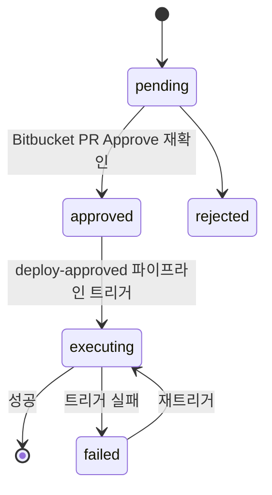

## 배경

레포에 쓰기 권한만 있으면 누구나 main 브랜치로 직접 배포 가능한 상태

- **리뷰 없는 배포** — 리뷰를 거치지 않고 배포하는 게 규칙 위반은 아니었고, 그냥 그걸 막는 장치 자체가 부재
- **가시성 부재** — 배포가 어떻게 진행되는지 알려주는 것도 없어서, 성공했는지 실패했는지 확인하려면 Bitbucket을 직접 열어봐야 함

"권한만 있으면 리뷰 없이도 배포가 나갈 수 있는 구조"를 막는 게 최초 목표였고, 승인 게이트를 만들면서 슬랙 알림이나 파이프라인 현황 조회 같은, 그때까지 아예 없던 주변 기능들도 같이 추가
처음엔 "PR을 리뷰어가 Approve하지 않으면 승인 버튼 자체를 막는다"는 단순한 규칙으로 시작했는데, 여러 레포에 적용해보면서 레포마다 운영 방식이 다르다는 걸 계속 확인

## 접근

처음 떠올린 방식은 단순 — 포탈 안에 "배포 요청 → 승인" 버튼을 하나 만드는 것
그런데 이 방식만으로는 원래 문제가 그대로 남는다는 걸 금방 파악
승인 상태를 포탈이 자체적으로만 관리하면, 리뷰어가 코드를 실제로 보지 않고도 그냥 승인 버튼을 누를 수 있음
"승인했다는 기록"과 "실제로 리뷰했다는 사실"이 분리될 수 있는 구조

그래서 기본 원칙 변경
승인 시점에 서버가 직접 Bitbucket API로 PR이 실제로 Approve됐는지 재확인하는 것으로 결정
프론트에서 "승인됨"이라고 보여주는 걸 그대로 믿지 않고, 승인 버튼을 누르는 그 순간 다시 확인하는 구조라 클라이언트 쪽 조작으로는 우회 불가
포탈이 별도의 승인 권한을 갖는 게 아니라, Bitbucket의 실제 Approve 상태에 포탈의 승인 상태를 종속시킨 것

상태 관리는 `pending → approved/rejected/executing/failed` 전이 규칙으로 설계
전이 전에 항상 현재 상태를 검증해서, 예상 밖의 상태면 예외를 던지고 전이를 차단
이 상태 머신 패턴은 이후 다른 요청 흐름(서버 접근 요청 등)에도 그대로 재사용

Terraform 레포 하나는 운영 방식 자체가 상이
요청자가 사실상 유일한 운영자였고, PR 리뷰는 다른 사람 승인을 받으려는 목적이 아니라 팀장에게 보고하려는 목적으로 요청하는 경우가 많았음
원래 규칙(요청자 본인은 승인 불가, 포탈 승인자와 PR을 Approve한 사람이 일치해야 함)을 그대로 적용하면 이 레포는 사실상 아무도 배포를 못 하는 상태가 됐을 것 같아서, 이 레포에 한해 "요청자 본인이 아닌 누군가가 PR을 Approve했는지"만 확인하고 포탈 승인은 요청자 본인이 눌러도 되도록 예외 처리

또 하나 다른 점은 웹훅 인바운드
사내 보안 방침상 외부에서 들어오는 요청을 막아둔 상태라 Bitbucket이 보내는 웹훅이 서버에 도달 불가
포트를 여는 대신, 서버가 Bitbucket API를 주기적으로 직접 조회하는 폴링 방식으로 우회
이미 파이프라인 완료 결과를 이런 식으로 60초 주기 폴링하고 있어서, push 감지에도 같은 패턴을 20초 주기로 그대로 확장

## 구현

배포 요청은 Store에서 `status` 필드로 상태 전이를 관리하고, 현재 상태를 검증하지 않고 잘못된 전이를 시도하면 예외를 던지도록 구현
승인 시 Bitbucket `deploy-approved` 파이프라인을 API로 자동 트리거해서, 사람이 수동으로 Bitbucket에 가서 다시 실행하는 단계도 제거

운영하면서 하나씩 채워 넣은 보강 지점은 다음과 같음

- **중복 요청 방지** — 동일 repo/branch 진행 중 요청 존재 시 기존 요청 반환, push 자동생성·수동생성 중복 pending 문제 해결
- **레포별 트리거 패턴 분기** — Terraform 레포만 plan/apply/destroy 구성 상이 → 승인 시 무조건 실패하던 문제 발견 후 분기 처리
- **파이프라인 중단·트리거 재시도** — 잘못 트리거된 파이프라인 즉시 중단, 트리거 실패로 방치된 요청 재트리거 기능 추가 (이전엔 Bitbucket 화면 직접 접근 필요)
- **Terraform plan 전체 로그 노출** — 요약 한 줄만 쓰던 방식에서 승인 전 전체 plan diff 확인 가능하도록 변경
- **웹훅 인바운드 차단 레포의 push 감지 폴링화** — 브랜치별 최근 커밋 주기 비교로 push 웹훅 대체, 초기 PR 머지 시 커밋 2개 감지로 요청·알림 중복 발송 버그 → 브랜치 최신 커밋 1개만 처리하도록 수정
- **빌드 현황 캐싱 전환** — 화면 진입마다 레포 전체(7개) 실시간 조회 → 30초 폴링 시 API 호출 과다 위험, 백그라운드 스케줄러가 캐시 채우고 화면은 캐시만 읽는 구조로 전환

이 과정에서 실사용도가 낮았던 파이프라인 실패율·Flaky 감지·트렌드 차트 화면은 제거
만들 때는 유용해 보였지만 실제로 아무도 안 보는 화면이라는 게 확인됨

## 결과

기능 자체는 완성됐고, 승인 흐름·중복 방지·중단·재시도까지 실제로 동작하는 것을 로컬·제한된 환경에서 확인

- **핵심 수치** — 적용 대상 레포 7개, 파이프라인 완료 확인 폴링 60초·push 감지 폴링 20초 주기, 빌드 현황 조회를 레포 전체(7개) 실시간 호출 방식에서 백그라운드 캐시 방식으로 전환
- **확정된 성과** — "권한만 있으면 리뷰 없이 배포 가능하던 구조"가 설계·구현 레벨에서 막힘, 레포마다 다른 운영 방식(예외 레포의 자기 승인 등)까지 코드로 반영
- **측정 불가** — 포탈 자체가 아직 전체 개발자에게 배포되지 않은 상태라 "실제로 막힌 무단 배포가 몇 건인지" 같은 실사용 규모의 효과는 이 시점에는 확인 불가
- **검증 남음** — 일부 보강 사항(레포별 트리거 패턴 분기, plan 로그 노출, 트리거 재시도)은 실제 상황이 아직 재현되지 않아서 코드 리뷰까지만 완료

## 회고

가장 크게 배운 건 규칙 하나로 모든 레포를 다 커버할 수 없다는 것
처음 설계한 승인 규칙은 합리적이었지만, 실제로 운영하는 사람들의 방식은 레포마다 달랐고 그 차이를 무시하면 오히려 게이트가 방해물이 됨
예외를 둘 때는 "왜 이 레포만 다른가"를 코드에 명확히 남겨서, 나중에 다른 레포에 똑같은 예외를 실수로 복사하지 않도록 하는 게 중요하다는 것도 같이 확인

웹훅이 막혀서 폴링으로 우회한 부분은 나쁘지 않은 선택이었다고 판단하지만, 폴링 로직을 새로 짤 때마다 커밋이 몇 개 잡히는지, 겹쳐서 중복 처리되지 않는지를 실제로 눈으로 확인하기 전까진 안심할 수 없다는 것도 다시 체감
push 감지 초기 버전의 중복 발송 버그가 그 사례

## 관련 문서
- [[01-사내 개발자 포탈 구축]]
