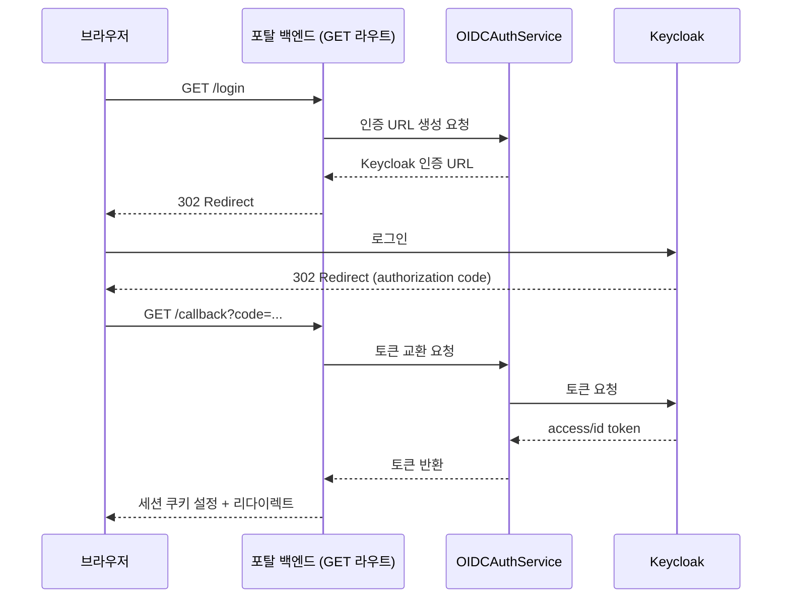

## 배경

포탈을 처음 만들 땐 인증 자체가 부재
Keycloak이 설정 안 된 상태에서는 인증 검사 함수(`verify_token`)가 그냥 빈 값을 돌려주고 통과시키는 구조였고, 사내망 안에서만 열리는 서비스라 당장 문제는 없었지만 언젠가는 SSO를 붙여야 하는 임시 상태
신규 API를 추가할 때도 이 바이패스가 언젠가 사라진다는 전제로 인증 데코레이터(`Depends(verify_token)`)를 꾸준히 붙여뒀는데, 그 전제를 실제로 검증하게 된 게 이번 마이그레이션

붙이는 방식도 포탈 혼자 정하지 않고, 사내 공용 인증 라이브러리(`keycloak-common-library`)를 가져다 쓰는 쪽으로 결정
다른 서비스와 인증 로직을 통일하려는 목적이었는데, 라이브러리가 기본 제공하는 방식과 포탈이 이미 갖고 있던 로그인 흐름(GET 리다이렉트 기반)이 서로 안 맞아서 그대로 얹기 불가
실제 운영에 반영한 뒤에도 약 보름에 걸쳐 크고 작은 장애를 연달아 경험

## 접근

라이브러리를 통째로 쓰지 않고 "OIDC 엔진"으로만 쓰기로 결정
라이브러리가 기본 제공하는 라우터를 그대로 마운트하면 로그인 URL을 JSON으로 반환하는 SPA 콜백 방식이라 프론트의 리다이렉트 흐름이 깨지고, 콜백도 GET이 아니라 POST라 지금 구조와 불일치
대신 라이브러리에서 인증 서비스 객체(`OIDCAuthService`) 하나만 가져와서, 포탈이 원래 쓰던 GET 리다이렉트 라우트(로그인·콜백·로그아웃·내 정보)를 그대로 유지하는 쪽으로 결정
덕분에 프론트엔드는 한 줄도 안 고치고 적용됐고, 백엔드에서 인증 관련 함수를 가져다 쓰던 다른 API 파일들도 함수 이름(`verify_token`, `require_admin`, `is_admin`)이 그대로라 무수정으로 통과

라이브러리가 세션·JWKS 캐시에 Redis를 요구해서 별도 캐시 인프라(ElastiCache)를 새로 연결
필수 설정값 중 콜백 URL처럼 라이브러리가 자동으로 계산해주지 않는 항목이 있다는 걸 미리 파악해두지 못한 게 이후 장애의 시작점

## 구현

운영에 반영한 뒤 실제로 겪은 장애 7건을 순서대로 정리하면 다음과 같음

- **로그인 무한 루프** — 토큰 audience가 클라이언트 ID 대신 기본값(`account`)으로 발급 → 검증 실패로 로그인→콜백→401→재로그인 반복 → 토큰 검증 자체 구현(`PyJWKClient`)으로 audience 검사 우회
- **로그인 후 API 전체 401/503** — 토큰 검증 HTTP 클라이언트의 User-Agent 헤더 누락 → Cloudflare가 봇으로 차단 → User-Agent 명시 지정으로 해결
- **로그아웃 시 에러 페이지** — 로그아웃 엔드포인트 필수 파라미터(`client_id`) 누락(마이그레이션 중 삭제) → 파라미터 복구로 해결
- **관리자 권한 미인식** — 토큰 `resource_access`에 클라이언트 항목 누락, Keycloak 클라이언트 scope 설정 문제 → 담당자 설정 변경 후 정상화
- **로컬 환경 로그인 콜백 반복 실패** — 발급·검증 시점 사이 정상 네트워크 지연(1~2초)만으로 `iat`/`nbf` 검증 실패, 라이브러리 leeway 미노출 → PyJWT 검증 로직 몽키패치로 최소 10초 여유 강제
- **빌드 시크릿이 로그에 평문 노출** — 회고에서 별도로 다룸
- **아바타 미노출, 승인자 이름 드롭다운 폴백**
  - 원인 — Keycloak이 사용자명을 표준 필드(`preferred_username`) 대신 커스텀 필드(`username`)로 발급, 콘솔 설정으로는 원인 미확인
  - 진단 — Redis 세션 토큰 원본을 직접 디코드해서 필드명 차이 확인
  - 해결 — 진입점(`verify_jwt_token`)에서 필드명 정규화

마지막 장애를 조사하는 과정에서 더 위험한 문제도 하나 발견
토큰에 이름이 비어 있을 때 프론트가 보낸 값을 그대로 승인자로 기록하고 있었음
아무나 드롭다운에서 이름을 골라도 그 이름이 승인 기록에 남을 수 있는 구조
신원 정보는 토큰에서만 가져오도록 막아서 같이 정리

## 결과

- **핵심 수치** — 운영 반영 후 15일(2026-08-06~2026-08-20) 동안 장애 7건 발생, 전건 원인 파악·수정 완료

지금은 로그인·로그아웃·권한 판정 모두 안정화된 상태
이 과정에서 신원 정보를 다루는 원칙(요청자·승인자는 반드시 토큰에서만 가져온다)이 코드 전반에 자리잡았고, 개인 액세스 토큰(PAT) 발급 로직도 이때 같이 점검하면서 발급 시점에 권한을 스냅샷으로 남기는 방식으로 정리

## 회고

이번에 제일 크게 배운 건 설정 화면이 맞아 보인다고 실제 값도 맞다는 보장은 없다는 것
필드 이름 하나가 표준과 다른 걸 찾아내는 데 가장 오래 걸렸고, 결국 콘솔이 아니라 실제로 발급된 토큰 내용을 직접 까보고 나서야 원인 확인
앞으로 비슷한 문제가 생기면 설정 화면보다 실제 응답값을 먼저 의심할 것 같음

빌드 시크릿을 이미지 빌드 인자(`ARG`)로 받았다가 캐시가 히트될 때마다 로그에 평문으로 남던 사고도 이 시기에 같이 경험
원인은 단순했지만(빌드 인자로 받은 값을 쓰는 명령어 전체가 이미지 레이어 기록에 남는다는 걸 몰랐음) 파급력이 커서, 이후로는 시크릿을 다루는 코드를 새로 짤 때마다 이 값이 로그나 레이어에 남을 수 있는 경로가 있는지부터 확인하는 습관 형성

라이브러리가 세부 옵션을 노출하지 않을 때 내부 로직을 직접 패치해서 우회한 부분(검증 여유 시간 등)은 당장은 해결됐지만, 라이브러리가 업데이트되면 다시 깨질 수 있는 부채로 남음
이런 우회는 왜 했는지, 라이브러리가 옵션을 지원하면 언제 되돌릴지를 코드 주석과 문서에 남겨두는 게 중요하다는 것도 다시 확인

## 관련 문서
- [[01-사내 개발자 포탈 구축]]
